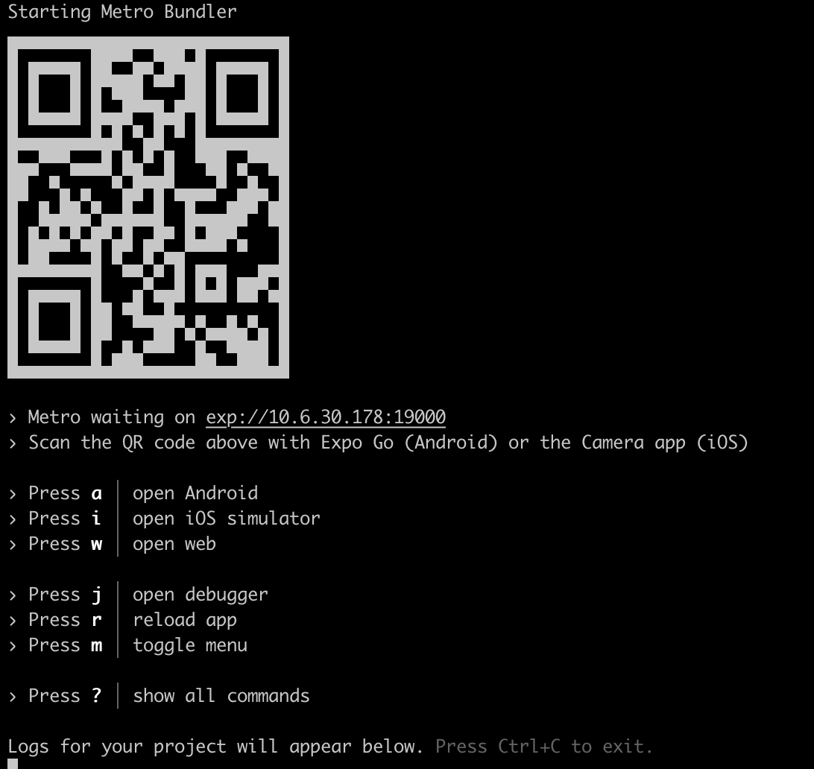

# BarterBox <!-- omit in toc -->

## Table of Contents <!-- omit in toc -->
- [High Level Overview](#high-level-overview)
  - [Features](#features)
  - [Technologies Used](#technologies-used)
- [Release One](#release-one)
  - [Release Functionality](#release-functionality)
- [Dependencies](#dependencies)
- [Build from QR Code](#build-from-qr-code)
- [Build from Repository](#build-from-repository)

## High Level Overview 
BarterBox is a lending/borrowing platform that facilitates the exchange of goods between individuals. Users can search for items on the marketplace and contact the lender to request the item for a specified duration. This platform aims to provide a convenient and secure way for people to access items they need without having to purchase them outright.

### Features
-  Marketplace: Users can search for items they need or offer items they want to lend to others.

-   Borrowing: Once a user finds an item they want to borrow, they can contact the lender to request the item for an agreed-upon period of time.

-   Lending: Users can list their items for others to borrow and set their own terms and conditions for borrowing.

-   Reviews: Users can leave feedback and reviews for lenders and borrowers to build trust within the community.

### Technologies Used
-   Backend: Firebase
-   Frontend: React Native, Expo
-   Database: Firestore

## Release One
There is limited functionality available in this release

### Release Functionality
-   Users can sign up and create a basic profile that can be used to login to the app
-   Users can view all items available on the marketplace 
-   Users can see which items they have borrowed and also see which items they have added to the app that could be borrowed by other users
-   Users can view their basic profile

## Dependencies
To install all dependencies from a cloned version of this repository:
-   manouver to the '/frontend' directory
-   run the following command
```bash
npm install
```

From this all necessary dependencies to build the project should be installed

## Build from QR Code
To view the app on an iOS or Android device that has 'Expo Go' installed, please scan the following QR Code.


The Login Credentials for viewing the Test User are:
```
Username: botterweck@barterbox.com
Password: test1234
```

## Build from Repository
To build the project run the following 
```bash
npx expo start
```

This should then provide a screen as such


From this a number of steps can be taken:

-   The QR code can be scanned using an android or iOS device that has the 'Expo Go' app installed 
-   If you are running on a MacOS device with XCode installed, press i, to emulate an iphone experience
-   Press w to open the web version of the app 
    -   (N.B. This app is not optimised for web use so for the best UI experience please use one of the methods prior to this) 

